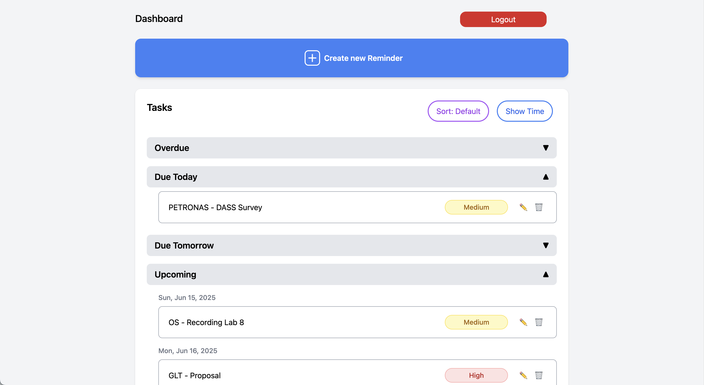

Perfect! Based on your answers and screenshot, here's a **wonderful, professional, and beginner-friendly `README.md`** tailored for your **Study Planner** project.

---

## 📝 Study Planner

> Plan smarter. Study better.

**Study Planner** is a web app built for students to efficiently organize tasks, assignments, and reminders. With a simple and clean interface, students can create, track, and manage their academic goals stress-free.

🔗 **Live Demo**: [https://study-planners.vercel.app](https://study-planners.vercel.app)

---

### ✨ Features

* ✅ **Task Reminders** — Create and categorize tasks by due date and priority.
* 📚 **Subject Tracker** — Stay on top of all your subjects and assignments.
* 🧠 **Easy Reminders** — Prominent "Create Reminder" button for quick additions.
* 👥 **User Auth System** — Sign up, log in, and reset passwords via email or Gmail.
* 🔐 **Multi-user Support** — Each user has a personalized dashboard.
* 🧪 **Upcoming Features** — We’re planning even more updates soon. Stay tuned!

---

### 🧑‍🎓 Who's it for?

**Students** who want a clean, straightforward way to manage their academic workload and tasks.

---

### ⚙️ Tech Stack

| Layer    | Tech                                |
| -------- | ----------------------------------- |
| Frontend | React                               |
| Backend  | Supabase (Auth + DB)                |
| Auth     | Supabase Auth                       |
| Hosting  | Vercel                              |
| Styling  | Tailwind                            |

> Note: Supabase is a backend-as-a-service platform; React talks to it directly through its SDK.

---

### 🚀 Getting Started

```bash
# Clone the repo
git clone https://github.com/your-username/study-planner.git

# Install dependencies
npm install

# Start development server
npm run dev
```

---

### 🔐 Environment Variables

Create a `.env.local` file and add:

```
VITE_SUPABASE_URL=your-supabase-url
VITE_SUPABASE_ANON_KEY=your-anon-key
```

> These keys are found in your [Supabase project dashboard](https://supabase.com/).

---

### 📸 Screenshots

Here’s a peek at the **Dashboard UI**:

 <!-- You can replace this with the actual image path or hosted URL -->

---

### 📌 Roadmap

* [ ] Subject filtering and color labels
* [ ] Dark mode
* [ ] Mobile responsiveness improvements
* [ ] Calendar integration
* [ ] Group study reminders

> Suggest features via Issues or PRs!

---

### 🤝 Contributing

Contributions are welcome! Please fork this repo and open a pull request.

* Open an issue first to discuss changes
* Follow consistent code style
* Be kind in PR reviews

---

### 📜 License

This project is licensed under the **MIT License**.
See the [LICENSE](./LICENSE) file for details.

---

### 🙏 Acknowledgments

* Powered by [Supabase](https://supabase.com/)
* Styled with 💖 by you
* Helped and supported by [ChatGPT](https://openai.com/chatgpt)